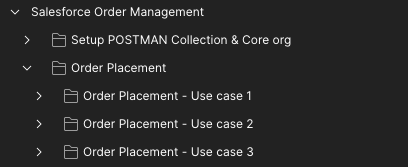
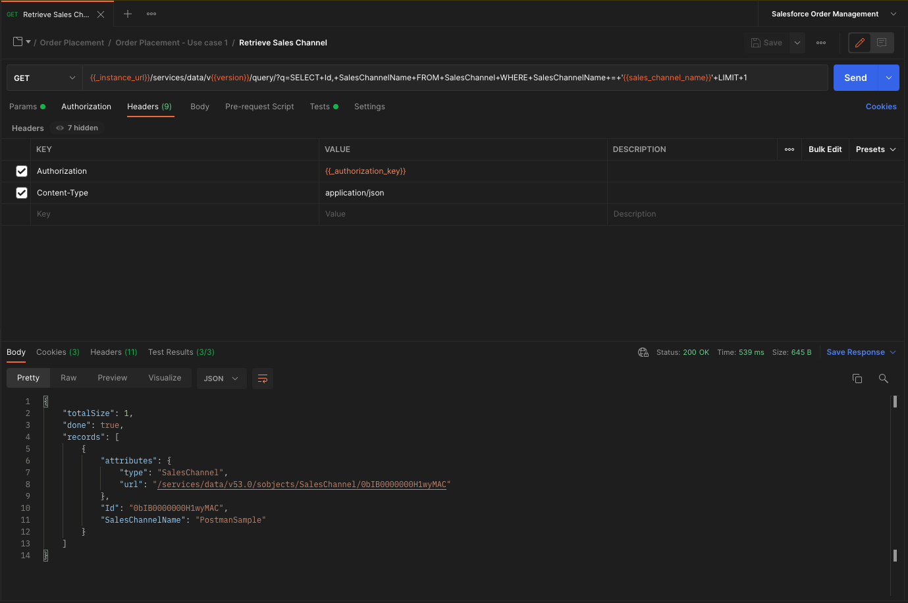

# Salesforce Order Management POSTMAN Collection

This repository contains a sample POSTMAN collection that you can leverage to understand how the Salesforce Order Management endpoints are working, and can be used to operate with your Salesforce Order Management instance.

## :gear: Get started

In order to start with this collection, please follow these steps:

1. Download POSTMAN from the [official website](https://www.postman.com/downloads/) and installed it
2. Once installed, open POSTMAN
3. Once opened, import the collection and the environment from this repository to your POSTMAN workspace
4. Once imported, open the `Salesforce Order Management` environment, and modify all the data which contain placeholders (like `<YOUR-CLIENT-ID-HERE>`) with your details. Please **don't modify the values with `{{` and `}}`, as these values are calculated values within your POSTMAN environment.**. The environment also contains sample values that you can use, or modify, as per your needs.
5. Once the environment is setup, open the `Salesforce Order Management` collection, and start using it.

## :gear: Where do I find these setup values?

This POSTMAN collection authenticate with the Salesforce instance by using the [OAuth 2.0 Username-Password Flow for Special Scenarios](https://help.salesforce.com/s/articleView?id=sf.remoteaccess_oauth_username_password_flow.htm&type=5). Please refer to this documentation to understand how this works.
As per the documentation, you need to create a [Connected App](https://developer.salesforce.com/docs/atlas.en-us.api_rest.meta/api_rest/intro_oauth_and_connected_apps.htm) to be able to use this way of authentication.

### url

If you are using this POSTMAN collection against a sandbox, the `url` environment variable is `https://test.salesforce.com`, else it is `https://login.salesforce.com`. You can also use the url of your instance directly, like `https://[your-domain].my.salesforce.com` if you set up a domain in the org.

### client_id and client_secret

The `client_id` and `client_secret` environment variables are the `Consumer Key` and `Consumer secret` values from the created connected app
In order to get them, please do the following steps:
1. Go to your instance
2. Go to the gear on the top right, and click on `Setup`
3. In the left sidebar, search for `App Manager`
4. Open the connected app you created in the beginning of this chapter
5. Click on the `copy` button to copy the `Consumer key` and use it as the `client_id` environment variable
5. Click on the `Click to reveal` and `copy` button to copy the `Consumer secret` and use it as the `client_secret` environment variable

### username and password

As this POSTMAN collection uses the `OAuth 2.0 Username-Password Flow for Special Scenarios`, it requires your username, password and security token.
Please use the username you use to authenticate against the org as the `username` environment variable, and your password as the `password` environment variable.

### security_token

As said in the previous section, this collection uses the `OAuth 2.0 Username-Password Flow for Special Scenarios`. This requires you to generate a security token, and use it as the `security_token` environment variable.
In order to generate it, please do the following steps:
1. Go to your instance
2. Click on your use avatar on the top right and click on `Settings`
3. In the left sidebar, click on `Reset My Security Token`
4. Click on the `Reset My Security Token` button. This will email you with the security token

## :information_source: Description

This collection contains use-case based sub-collections. The collection is divided into multiple main components. Basically, the first component is the collection and instance setup, and others contain the use cases.

Within these use-case based folders, you'll find a sub-collection per use case, which contains the list of endpoints which need to be used to perform the desired operation and validate that the operation worked.

All endpoints contain unit tests, which allows the collection to ensure:

:white_check_mark: The endpoints respond with the correct data/behavior based on the use-case

:white_check_mark: The API is working as expected, by validating the data before/after some operations, to ensure the API is doing what we expect

## :asterisk: Use cases covered

### :new: Order placement

The order placement use cases are the following:

#### :hash: Use case 01

1. One single order insertion
2. Account insertion (so each time, a new account is created by default)
3. One single order delivery group, along with its order delivery method
4. Two products insertion, within the same order delivery group
5. No promotions

#### :hash: Use case 02

1. One single order insertion
2. Reuse the account previously created in the setup
3. One single order delivery group, along with its order delivery method
4. Reuse the two products previously created in the setup, within the same order delivery group
5. No promotions

#### :hash: Use case 03

1. One single order insertion
2. Reuse the account previously created in the setup
3. Two order delivery groups, along with the same order delivery method, but to two different shipping addresses
4. Reuse the two products previously created in the setup, within the same order delivery group
5. One order-level promotion

## :rocket: How to?

### How to use the collection?

You can leverage this collection in differente ways:

:arrow_forward: By using any endpoint one-by-one. Please remember to always authenticate first, by using any of the authentication endpoint available within the use-case collections.

:next_track_button: By using the [POSTMAN Runner](https://learning.postman.com/docs/running-collections/intro-to-collection-runs), which will run a full use-case directly, by executing each endpoint one-by-one, sequentially, and so report the unit tests results for each executed endpoint.

## :fast_forward: TODO

Here are the already identified items of the todolist:

- Add fulfillment use cases (creation / update / cancel of fulfillment order item)
- Add invoicing use cases (invoice creation)
- Add credit memo use cases (credit memo creation)
- Add discount use cases
- Add cancellation use cases
- Add return use cases
- Add capture use cases (calling `EnsureFunds`)
- Add refund use cases (calling `EnsureRefunds`)
- Add routing use cases